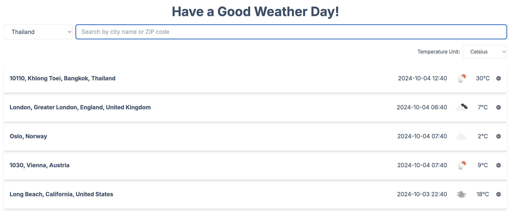
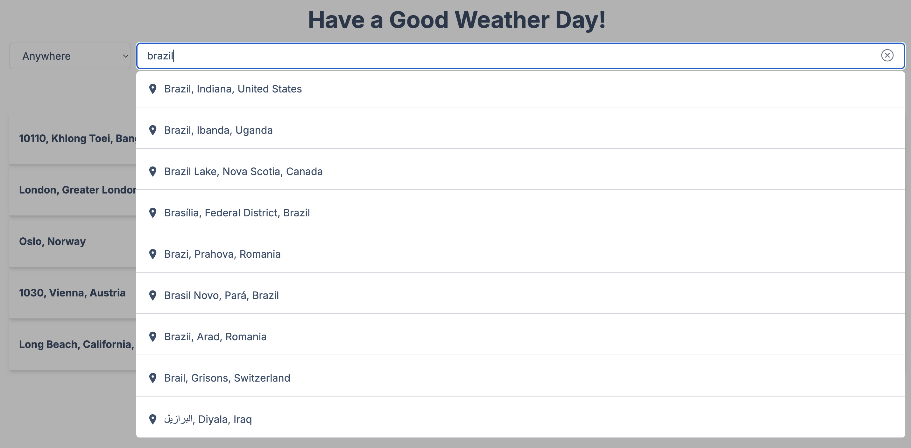
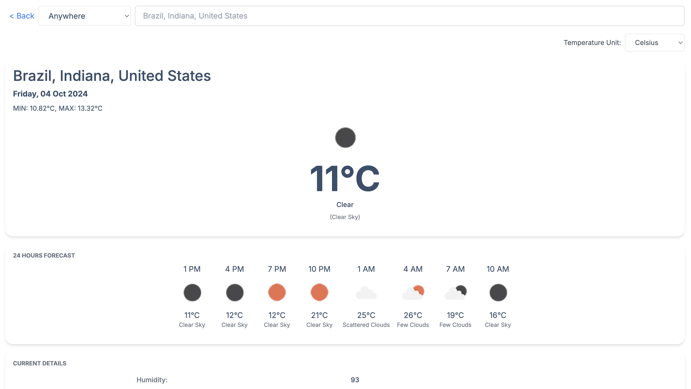
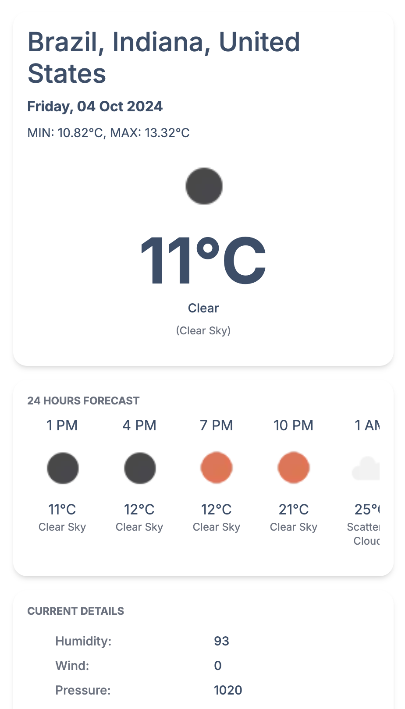

# Frontend Challenge

## Overview

A weather application that helps users find weather information for cities around the world.
No login is required, and the application is designed to be simple and easy to use.
Implemented using Next.js, TypeScript, and Tailwind CSS.

# Features

## Screenshots

## Index Page

- Search Box: Allows users to search for cities by name or ZIP code
  - Provides a suggestion list as the user types.
  - City List: Display a list of cities selected by the user along with the current time and average temperature.
  - User can manage the list by adding or removing cities.

## Search Cities Box

- Auto-Suggestions: When typing in the search box, display a list of suggested cities based on the input.
- City Selection: Allows user to select a city from the suggestion list to add to their index.

## Detail Page

- City Weather Details: Display detailed weather information for the selected city, including:
  - Average Temperature
  - Minimum and Maximum Temperature
  - Weather Icon
  - Main Weather (e.g., Rain, Snow, Sunny)
  - Weather Description
  - Wind Speed
  - Humidity
  - Pressure
  - Rain Volume
- 24-Hour Forecast: Show a forecast for the next 24 hours, including temperature and weather conditions.

## Extra Features

- Temperature Unit Configuration: Allow users to select their preferred temperature unit (Kelvin, Fahrenheit, Celsius).
- Responsive Design: Ensure the application is responsive and works well on various device sizes.
- Current Date and Time: Display the current date and time for each city in the list.

## Data Source

### OpenWeather API

https://openweathermap.org/api

### Weather icons

https://openweathermap.org/weather-conditions

### Places API

- https://api.mapbox.com/geocoding/v5/mapbox.places
- https://restcountries.com/v3.1/all?fields=name,cca2
